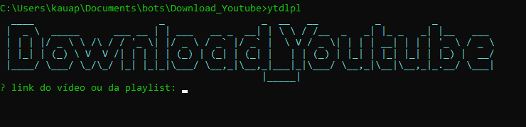

# Download_Youtube

Download_Youtube is a CLI tool used to download playlists and videos from youtube in ```MP4``` and ```MP3``` formats.

* Leave your ```star``` for more people to see the project.
* Comment on how I could improve the project.


# ✨ Home.

* Have ```NodeJs``` and ```Chrome``` on your machine, to run the project.

* Type ```npm install``` in your project folder terminal, and wait for the packages to download.

* type ```npm link``` to use as a global variable.

# ❔ How to use?


* The tool is simple to use. to get started just type ```npm run start``` , ```node .``` or ```ytdownload```



* right after paste the link of the video or youtube playlist you want to download and confirm.


* Choose download format.


* right after the playlist scan will be started (if a playlist is detected)


* when the scan is finished, the download process will start.


**NOTE: If you have any video with age restriction or region blocking, it will give an error and ignore this video and go on with life.**

# 🎶 Result!


# 🌟 Finalization

Thank you for collaborating with the project!
